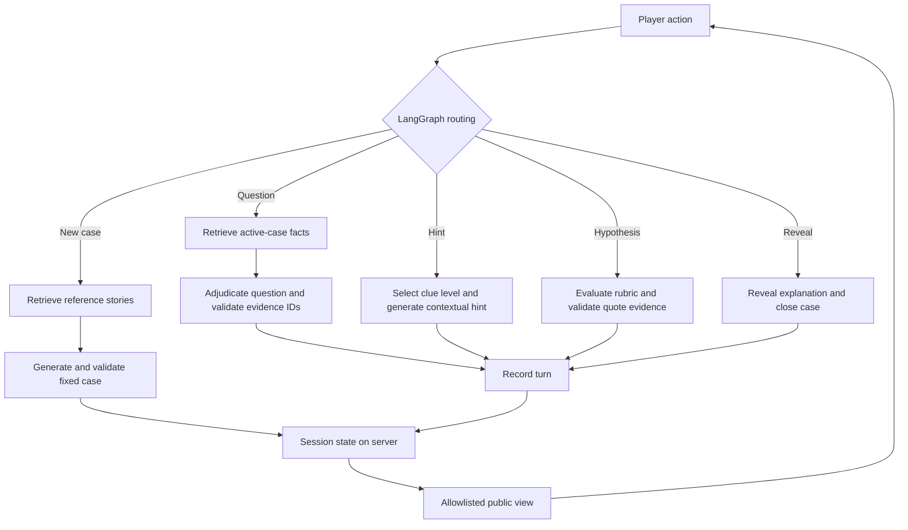

# Mystery Graph

**An interactive mystery game powered by Hugging Face models, LangChain, and LangGraph.**

Create a strange scene, investigate it through questions, ask for increasingly explicit hints,
and submit an explanation. A fixed hidden case keeps the investigation anchored to the same
facts instead of letting the language model invent a different answer every turn.

Hugging Face models provide generation and embeddings. LangChain retrieves relevant story
examples and composes structured generation chains. LangGraph manages conversational state
across question answering, hint generation, and hypothesis evaluation. Python implements the
game rules and Gradio provides the interface.

## How the game works

1. **Create a case.** Choose a setting and difficulty. Semantic retrieval selects reference
   mysteries; the model generates an original scene, private explanation, facts, clues, and rubric.
2. **Investigate.** Ask yes/no questions. The application retrieves facts from the active case,
   asks the model to adjudicate the question, and checks its evidence references.
3. **Request hints.** A state-based policy selects an unexplored clue and its permitted level
   of detail. The model rephrases it in the context of the recent conversation.
4. **Propose an explanation.** The model maps exact quotes in your hypothesis to the hidden
   rubric. Victory requires every criterion in the current answer, after reference validation.
5. **Close the case.** Solving or explicitly revealing the explanation ends the investigation.

## Technology responsibilities

| Component | Role in the application | Implementation |
| --- | --- | --- |
| Python | Validated game state, clue progression, input limits, solution visibility | `schemas.py`, `graph.py` |
| Hugging Face InferenceClient | Hosted text generation using a configurable Hub model and provider | `models.py` |
| Hugging Face Transformers | Optional local text generation without a hosted inference key | `models.py` |
| Hugging Face Sentence Transformers | Local semantic embeddings for reference stories and case facts | `retrieval.py` |
| LangChain | Prompt templates, retrievers, vector stores, Runnable composition, Pydantic output parsing | `generation.py`, `retrieval.py` |
| LangGraph | Explicit action routing and state updates for every stage of an investigation | `graph.py` |
| Gradio | Browser interface and session-specific server state | `ui.py` |

## Architecture



There are **two retrieval contexts**. The reference corpus informs story generation; it never
becomes the truth of the newly generated case. Subsequent question answering retrieves only
from that case's immutable canonical facts. Each case has its own vector index, keyed by its
validated serialized content. No other player's facts are queried.

For this small corpus, LangChain's `InMemoryVectorStore` performs cosine-similarity retrieval
without a database service. Complete short examples and atomic facts are indexed as documents,
so arbitrary text chunking is unnecessary. Embeddings are normalized before indexing.

See [the architecture notes](docs/architecture.md) for state ownership, hint selection, failure
handling, and the boundaries of model-based evaluation.

## Setup

Use **Python 3.11–3.13**. Python 3.11 is the reference version for the optional check workflow.

```bash
git clone https://github.com/MelenL/mystery-graph.git
cd mystery-graph
python3 -m venv .venv
source .venv/bin/activate
python -m pip install --upgrade pip
python -m pip install -e .
cp .env.example .env
```

On Windows PowerShell, activate with `.venv\Scripts\Activate.ps1` and use
`Copy-Item .env.example .env`. All commands below are instructions to run explicitly; installing
the package does not start the interface or call a model.

### Option A: hosted inference

Set the following in `.env`:

```dotenv
MODEL_BACKEND=hf
HF_TOKEN=your_hugging_face_token
HF_MODEL_ID=openai/gpt-oss-120b
HF_PROVIDER=auto
```

The token must have access to Inference Providers. Provider availability, account credits,
model access, and billing are controlled by Hugging Face and the selected provider. Select an
available instruction-following **chat-completion** model. A Hub model existing does not mean
that a provider serves it. `HF_MODEL_ID` and `HF_PROVIDER` can be changed without editing code.

Prompts are sent through Hugging Face to the chosen inference provider. Embeddings are computed
locally; the first use downloads `sentence-transformers/all-MiniLM-L6-v2`.

### Option B: local generation without an API key

```bash
python -m pip install -e '.[local]'
```

```dotenv
MODEL_BACKEND=local
LOCAL_MODEL_ID=Qwen/Qwen2.5-1.5B-Instruct
LOCAL_DEVICE=cpu
```

The public model can be downloaded without an inference token. CPU inference can be slow;
`cuda:0` or `mps` can be used with a compatible PyTorch installation and sufficient memory.
The small default reduces hardware requirements but may produce weaker puzzles or invalid JSON.
A larger compatible chat model can improve output quality. Model weights are downloaded on
first use; subsequent generation and embeddings can remain local when the caches are complete.
Set `HF_HUB_OFFLINE=1` only after downloading everything needed. Model licenses are separate
from the repository's MIT license.

### Start the interface when ready

```bash
mystery-graph
# Equivalent:
python app.py
```

Open `http://127.0.0.1:7860`. Models and embeddings initialize when the first case is requested.
In hosted mode, a missing token is reported before loading embeddings or making an inference
request. The application uses a local bind address and does not create a Gradio public share link.

## Configuration

| Variable | Default | Purpose |
| --- | --- | --- |
| `MODEL_BACKEND` | `hf` | `hf` hosted inference or `local` Transformers |
| `HF_TOKEN` | empty | Hosted inference credential; never commit it |
| `HF_MODEL_ID` | `openai/gpt-oss-120b` | Hosted chat model |
| `HF_PROVIDER` | `auto` | Provider selection |
| `HF_TIMEOUT_SECONDS` | `90` | Timeout per hosted request |
| `LOCAL_MODEL_ID` | `Qwen/Qwen2.5-1.5B-Instruct` | Local model |
| `LOCAL_DEVICE` | `cpu` | Local text-generation device |
| `EMBEDDING_MODEL_ID` | `sentence-transformers/all-MiniLM-L6-v2` | Local embedding model |
| `EMBEDDING_DEVICE` | `cpu` | Embedding device |
| `RETRIEVAL_K` | `3` | Reference count; fact retrieval uses `k + 2` |
| `MAX_GENERATION_TOKENS` | `3500` | Per-request output budget |
| `CORPUS_PATH` | bundled JSON | Optional replacement reference corpus |
| `HOST`, `PORT` | `127.0.0.1`, `7860` | Interface address |
| `APP_USERNAME`, `APP_PASSWORD` | empty | Required together for a non-local bind |

Copying `.env.example` also disables LangSmith tracing, HF telemetry, and Gradio analytics.
Existing environment variables take precedence over `.env`. Keep traces disabled when handling
private stories or conversations. Password authentication alone is not a production deployment:
use TLS, rate limiting, and appropriate session controls before exposing a paid inference service.

## Repository layout

```text
app.py                         Convenience entry point
src/mystery_graph/
  config.py                    Environment configuration and credential checks
  schemas.py                   Generated case, evidence, hints, evaluation schemas
  models.py                    Hugging Face hosted/local adapters
  prompts.py                   Task-specific instructions
  generation.py                LangChain structured generation chains
  retrieval.py                 Reference and case-specific semantic retrieval
  graph.py                     LangGraph nodes, transitions, and public projection
  ui.py                        Gradio interface and lazy initialization
  data/references.json         Eight original, hand-authored reference mysteries
tests/                         Offline contract tests using synthetic fixtures
docs/architecture.md           Design decisions and model limitations
docs/validation.md             Validation status and a manual evaluation procedure
.github/workflows/             Manually triggered checks only
```

## Validation and limitations

**This implementation has not been launched or tested against a live model.** No inference
quality, latency, puzzle success rate, or benchmark results are claimed. The test suite is
provided for later execution; its presence is not a statement that it has passed.

To run the offline contract tests explicitly:

```bash
python -m pip install -e '.[dev]'
ruff check .
HF_HUB_OFFLINE=1 TRANSFORMERS_OFFLINE=1 LANGSMITH_TRACING=false pytest
```

The tests use fake model outputs and deterministic fixture embeddings. They cover routing,
state isolation, schema retries, evidence references, victory conditions, bounded hints, and
failure atomicity. They do not validate semantic model quality or hardware compatibility.
The GitHub Actions workflow is **manual only** and does not run on push or pull request.

Remaining limitations include LLM mistakes, incomplete fact retrieval, prompt injection,
potential spoiler leakage from generated scenes/hints, and imperfect hypothesis grading.
Structural checks cannot prove that a puzzle is solvable or that an evaluation is semantically
correct. State is ephemeral and single-process: refreshing a tab, expiry, or a server restart
can lose the game. See [validation notes](docs/validation.md) for practical checks.

## References

- [Hugging Face InferenceClient](https://huggingface.co/docs/huggingface_hub/en/guides/inference)
- [LangChain Hugging Face embeddings](https://docs.langchain.com/oss/python/integrations/embeddings/huggingfacehub)
- [LangChain vector stores](https://docs.langchain.com/oss/python/integrations/vectorstores)
- [LangGraph Graph API](https://docs.langchain.com/oss/python/langgraph/graph-api)
- [Gradio session state](https://www.gradio.app/guides/state-in-blocks)

## License

Code and the bundled original reference corpus are provided under the [MIT license](LICENSE).
